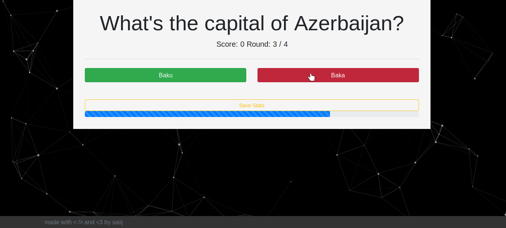
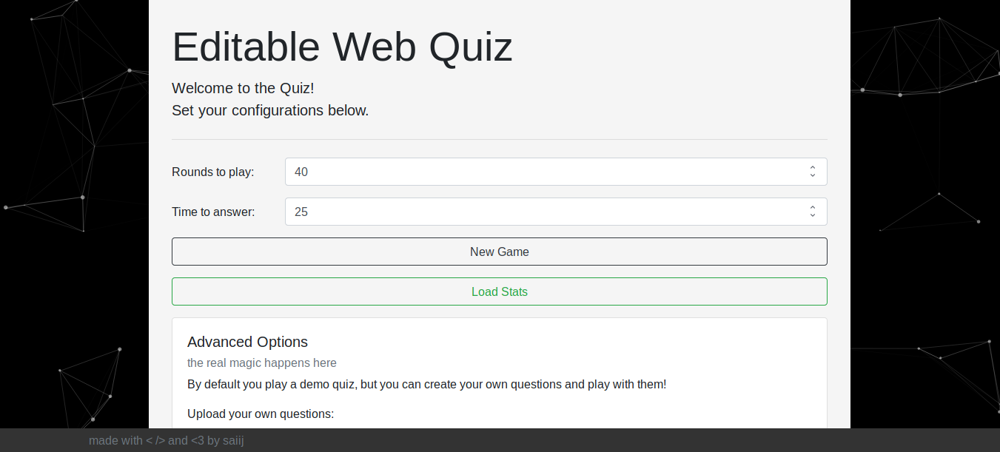
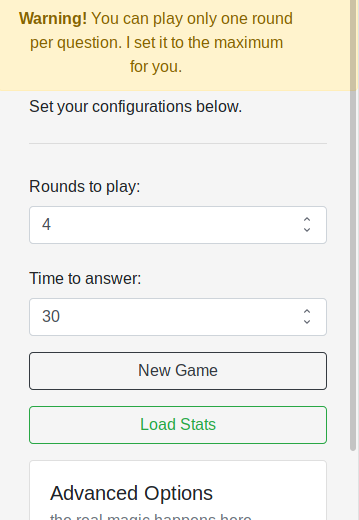

# The Editable Web Quiz
&nbsp;
[](https://github.com/saiij/editable-web-quiz/blob/master/LICENSE)
&nbsp; 

&nbsp; 
[](https://github.com/saiij/editable-web-quiz/issues)
&nbsp;
[](https://github.com/saiij/editable-web-quiz/network)

_An editable quiz based on javascript to learn for everything._
> 
*  for mobile and desktop enviorments 
*  1 to 4 answer Buttons 
*  100% offline! (after setup)

## Features

You can select the rounds to play,
the time you have to answer per question in seconds and it's also possible to upload and even create your own questions with ease. You can also save, load and delete your stats.

## Setting up & Running

```shell
git clone https://github.com/saiij/editable-web-quiz.git
cd editable-web-quiz/
npm install
# Open src/index.html in your default browser e.g.
open src/index.html
```

## Contributing

Please follow our [Contribution Guidelines](./CONTRIBUTING.md).

## Create and download your own questions

To create your own questions you click on the 'Create Question' button.
Type in a question and at least one answer and then select the correct answer with a double tap. As next, you click on the 'Add Question' button to save the question.
If you have at least two questions saved, the download button becomes enabled and you can download your questions.

## Use your own questions

To use your own questions you just need to select them via the 'Browse...'-button.
Then you set up the rounds to play and time to answer fields and click on 'New Game'.
At this moment your questions will load and you can learn for everything.

## Screenshots





## Built With

[Bootstrap 4](https://github.com/twbs/bootstrap) - Framework for developing responsive, mobile first projects on the web.     
[particle.js](https://github.com/VincentGarreau/particles.js) - A lightweight JavaScript library for creating particles

## License

This project is licensed under the MIT License - see the [LICENSE](LICENSE) file for details

## Acknowledgments

Special thanks to [Nordiii](https://github.com/Nordiii) for providing me with useful random knowledge.


## Contributors

- [Rohit Raj Anand](https://github.com/rht6226)
- [Praveen Kumar Purushothaman](https://praveen.science/) ([GitHub](https://github.com/praveenscience/) &bull; [Blog](https://blog.praveen.science/))
- [Victoria Zhong](https://github.com/SemicolonExpected)
- [Susan Truong](https://github.com/susantruong)
